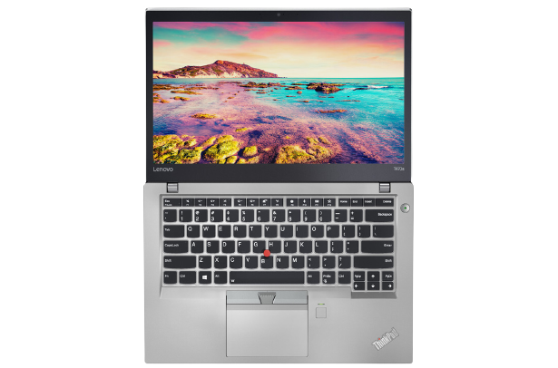

<!--
*** Thanks for checking out the Best-README-Template. If you have a suggestion
*** that would make this better, please fork the repo and create a pull request
*** or simply open an issue with the tag "enhancement".
*** Thanks again! Now go create something AMAZING! :D
-->

<!-- PROJECT LOGO -->
 

  

  <h3 align="center">ThinkPad T470s OpenCore</h3>

  

    macOS Monterey
     
     
    <a href="https://github.com/GiovanniBaccichet">My Profile 👨🏻‍💻</a>
    |
    <a href="https://github.com/GiovanniBaccichet/R-E-P-O/issues">Report Bug 🐛</a>
    |
    <a href="https://github.com/GiovanniBaccichet/R-E-P-O/issues">Request Feature ✨</a>
  

<!-- ABOUT THE PROJECT -->

## Hardware Specifications 🔍

Tested on the following hardware:

| Component             | Details             |
|-----------------------|---------------------|
| **CPU**               | Intel Core i5 7200U |
| Processor Speed       | 2.71 GHz            |
| Number of Processors  | 1                   |
| Total Number of Cores | 2 (+2)              |
| **Memory**            | 20 GB               |
| Type                  | DDR4                |
| Speed                 | 2133 MHz            |
| **Graphics**          | Intel HD 620        |
| **Network** | Intel Wireless 8265 / 8275 Wifi and Bluetooth wireless interface |
| **Monitor** | 1920x1080 Non-Touch |

## Working 🏗

 - Display;
 - WiFi;
 - Bluetooth;
 - Ethernet (10/100/1000);
 - Audio;
 - Trackpad (w/ multitouch gestures, but not that great);
 - Trackpoint;
 - SD Card Reader;
 - Thunderbolt 3 (display output and charging);
 - Hibernation;
 - Virtualization.

## Not Working 🪦

 - Dual battery not recognized;
 - Smart card reader (not tested);
 - WAN (not tested);
 - Fingerprint reader.

## Usage 📝

SMBIOS has to be generated and placed in `config.plist` under the fields with value `REPLACE`. In particular:

 - `MLB`
 - `ROM`
 - `SystemSerialNumber`
 - `SystemUUID`

This information can be generated using GenSMBIOS w/ `SystemProductName: MacBookPro14,1`.

<!-- CONTRIBUTING -->

## Contributing 💬

Contributions are what make the open source community such an amazing place to be learn, inspire, and create. Any contributions you make are **greatly appreciated**.

1. Fork the Project
2. Create your Feature Branch (`git checkout -b feature/AmazingFeature`)
3. Commit your Changes (`git commit -m 'Add some AmazingFeature'`)
4. Push to the Branch (`git push origin feature/AmazingFeature`)
5. Open a Pull Request

<!-- ACKNOWLEDGEMENTS -->

## Acknowledgements 📖

-   [T470-Hackintosh-OC-Monterey-7300u](https://github.com/t0mmas0/T470-Hackintosh-OC-Monterey-7300u)
-   [Opencore-T470s](https://github.com/Elemiel-K/Opencore-T470s)
-   [GenSMBIOS](https://github.com/corpnewt/GenSMBIOS)

<!-- LICENSE -->

## License 📑

Distributed under the GPLv3 License. See `LICENSE` for more information.

<!-- CONTACT -->

## Contact 📬

Giovanni Baccichet - [@Giovanni_Bacci](https://twitter.com/Giovanni_Bacci) - `github[at]baccichet.org`
